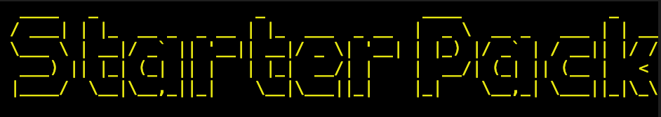

[starterpk.js.org](https://starterpk.js.org) | [@StarterPackCLI](https://twitter.com/StarterPackCLI)

# Documentation

## What is Starter Pack?

Unifies all the other CLI tools. Forget having to install/remember/google lots of different
commands, access them all through Starter Pack!

This also means you don't have to worry about always keeping the various CLI tools you use up to
date because Starter Pack will take care of it for you. Keep Starter Pack up to date and all your
other CLI tools will be as well!

Not comfortable with using the Terminal/Command Line? Or just prefer GUIs instead? Use the Starter
Pack GUI tool instead!

(Coming Soon) Starter Pack is extendable. Is there a certain set up you'd like to add? No problem,
just add it in our starterpack.json/starterpackrc

(Coming Soon) Introduces you to new tool/technologies (by seeing different packs in the terminal/gui
that you might not have seen/heard/tried before)

(Coming Soon) Promotes best practices. We're so much more than just a tool. We strive to ensure that
any tech you build is done so in the best way possible. That's why we provide every set up with a
collection of best practices that you can refer to as you build. We won't hold your hand and guide
you every step of the way, we'll simply add some documentation to each pack that you can refer to
whenever you want. And if you'd rather do it your own way, that's fine too - just say 'no' when
asked - or tag --no-docs when running a command

## Who is Starter Pack for?

Everyone! We have created a tool that is (hopefully) accessible to developers of all skill levels.

## There are already lots of CLI tools with their own standards. Doesn't this just create another competing standard?

This is an understandable concern. So Starter Pack is made up of many 'Packs'. A Pack is simply a
project set up. One example of a Pack would be a React project. While a few of the packs we offer
have been created from scratch, most of them are actually interfaces on top of existing CLI tools.

One such example would be our Svelte Pack. This simply uses the same commands you would use to
create a Svelte project with the Svelte CLI tool. The only difference here is that you don't have to
ever worry about downloading or explicitly making use of Svelte's own CLI tool every time you want
to make a new project. The same applies to React, Vue and Angular. Rather than using their own CLI
tools, Starter Pack provides a single interface on top of all of them. And because it is just an
interface (and not an implementation), whenever respective CLI tools (such as Angular, React,
Svelte, and Vue) update, you can be sure that Starter Pack is still pulling in the latest version.

### Commands

In the command line, type `@starter-pack/cli` and press the `enter` key. This will start the CLI
tool.

You will then be asked two questions:

1. What would you like to name your project?
2. Which Starter Pack would you like to use?

Your answer to the first will become the name for your project. This will appear as the name in your
`package.json` and will become the name for the folder of your project.

Your answer to the second question determines what type of pack you will have.

For example, if you decide to call your project 'The Best App' and choose to use Vue, Starter Pack
will create a Vue project called 'the-best-app'.

Bear in mind that the project will be created in the same directory as wherever you have executed
the command.

### Available Packs

Currently, Starter Pack offers the following:

- Angular
- React
- React (Next.js)
- React + Express
- React + TypeScript
- Svelte
- Vue
- Vue + TypeScript
- Website

We have plans to add more in the future. In the meantime, reach out to us over
[Twitter](https://twitter.com/StarterPackCLI) if you have any Pack suggestions/requests.

### The GUI

We wanted to ensure that Starter Pack is as developer and beginner friendly as possible. It's also
the 21st Century, and not every technical task has to be carried out in the command line when nicer
solutions are available. Therefore, we took inspiration from Vue CLI UI and made a Starter Pack GUI
tool.

Users have all of the options available in the CLI tool, plus the ability to pick where to create
the project on their device.

At the moment this is offered as a tool that needs to be loaded from the command line (ie, setting
up a local server to execute the project - it's created with Node/Express for anyone curious).
Ideally we would like to turn this into a standalone app that users can download. Maybe this will be
created with Electron. Either way, we hope to create this in the near future.

### Best Practices

Coming Soon - we need help with this...continue reading if you're interested in contributing towards
open source!

### What we need help with

Here are a few things that you can help with:

- Best Practices documentation for any of the technologies our Packs offer
- Tests for our CLI/GUI tools
- More extensive docs
  ([Here's a Markdown cheatsheet if you're interested in helping to create/improve our docs](<(https://github.com/adam-p/markdown-here/wiki/Markdown-Cheatsheet)>))
- More Packs
- Ways to make Starter Pack CLI/GUI extendable (so that users can customize packs if they choose to)
- At the moment, our GUI is only tested to work on Mac devices. We (obviously) need to ensure that
  this works as expected in other environments such as Windows and Linux. So any help with that is
  much appreciated!

Reach out over [Twitter](https://twitter.com/StarterPackCLI) or by making a Pull Request to any of
our repos.

We also recommend giving this great article a read on
['How to Contribute to Open Source'](https://opensource.guide/how-to-contribute/)
